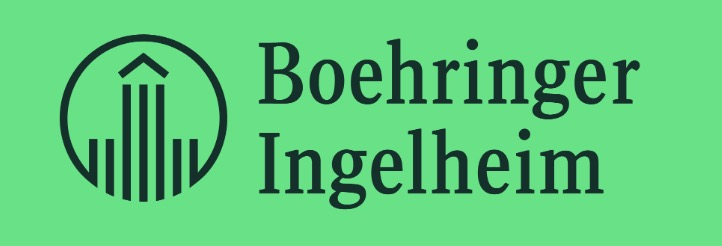
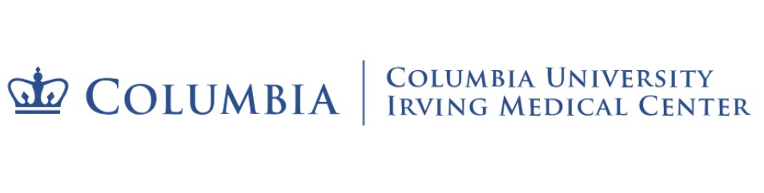
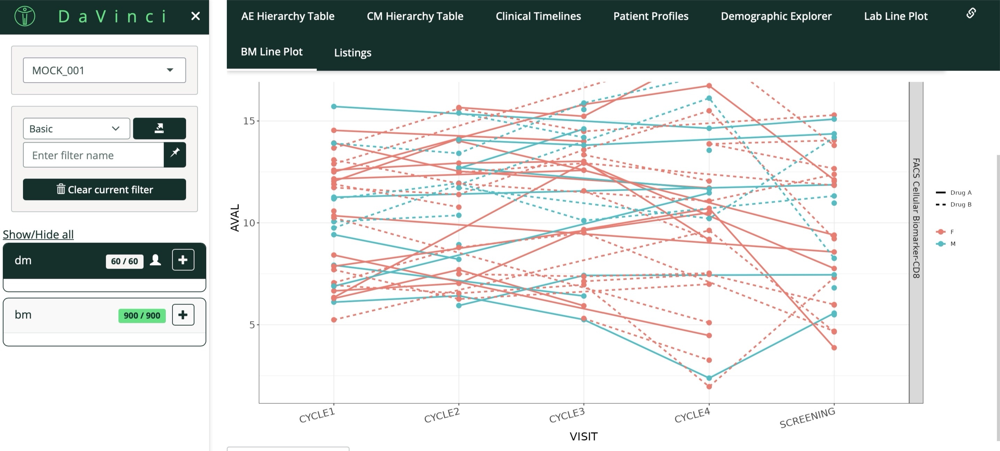

# Hello! 你好！こんにちは！Bonjour!
# Welcome to my website!

<strong>Clinical Data Science Co-op</strong> 
Boehringer Ingelheim

<strong>M.S. Biostatistics</strong> 
Columbia University (2026)

<strong>B.A. Mathematics & Statistics</strong> 
Boston University (2024)

---

About Me

I am a Master of Science student in Biostatistics at Columbia University, with a background in statistics, clinical data science, and public health research. My interests include clinical trial data visualization, statistical programming, survival analysis, and real-world health data analytics.

I have experience working with R, SAS, SQL, Python, Shiny, and Tableau. My projects focus on translating complex datasets into clear statistical insights, interactive dashboards, and decision-support tools for research and clinical data review.

Previous Projects

Selected projects in clinical data science, biostatistics, and data visualization.  
*Note: The interactive app may take a few seconds to load on first visit.*

<a href="https://shiyingwu-angel.shinyapps.io/clinical-data-explorer/" target="_blank">

R Shiny Interactive Clinical Data Explorer

</a>

<a href="yelp_project.html">

R Shiny Yelp Restaurant Analyst

</a>

<a href="sas.html">

SAS Clinical Data Analysis

</a>

© 2026 Shiying Wu (Angel)

