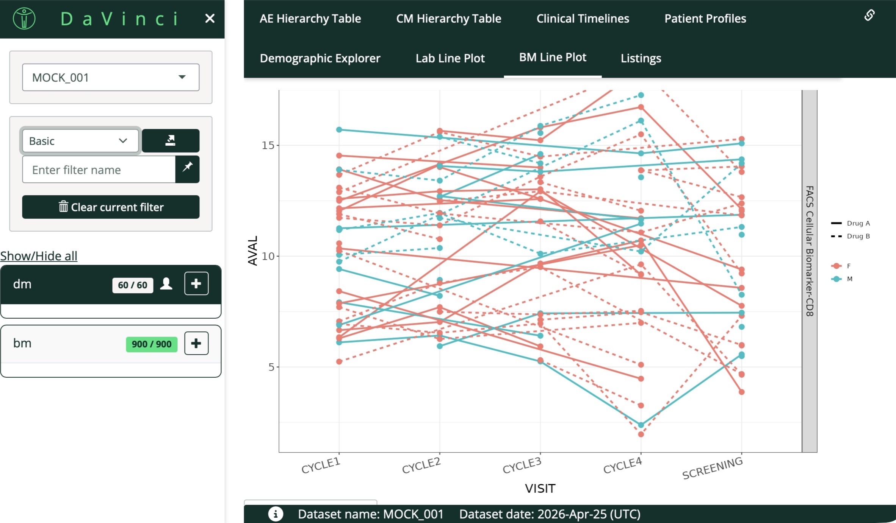

Here are selected projects in data science, biostatistics, and interactive application development.

<a href="https://shiyingwu-angel.shinyapps.io/clinical-data-explorer/" target="_blank">
Clinical Data Explorer (R Shiny)
</a>

An interactive clinical data exploration tool built with R Shiny, supporting patient-level visualization, safety review, and longitudinal analysis across multiple clinical domains.

R Shiny
Clinical Data
CDISC SDTM
Data Visualization

<a href="yelp_project.html">Pennsylvania Yelp Restaurant Analysis & Finder</a>

A team project combining Yelp restaurant data analysis with an interactive Shiny app for restaurant search by city, time, cuisine, price, and rating.

R Shiny
Statistical Model
Data Visualization

<a href="sas.html">SAS Clinical Data Analysis: MetS & Memory</a>

A SAS-based biostatistics project analyzing the association between metabolic syndrome and episodic memory through data cleaning, clinical variable derivation, and regression modeling.

SAS
Biostatistics
Regression
Clinical Research

