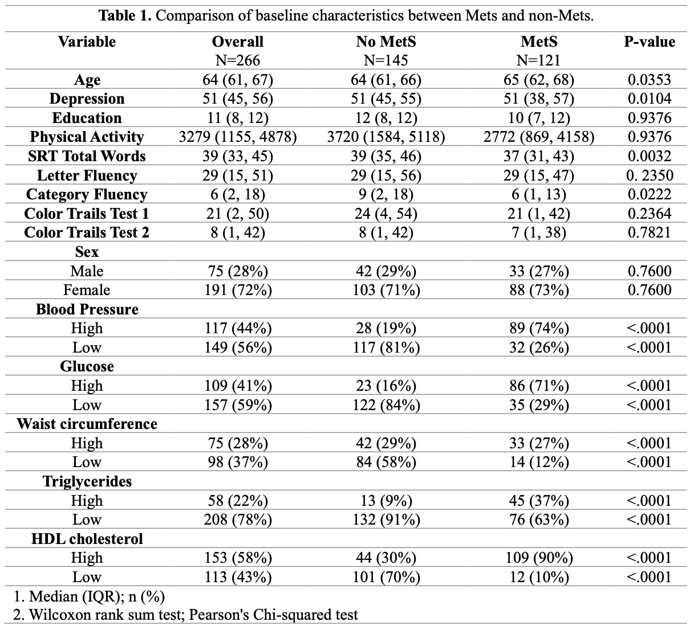
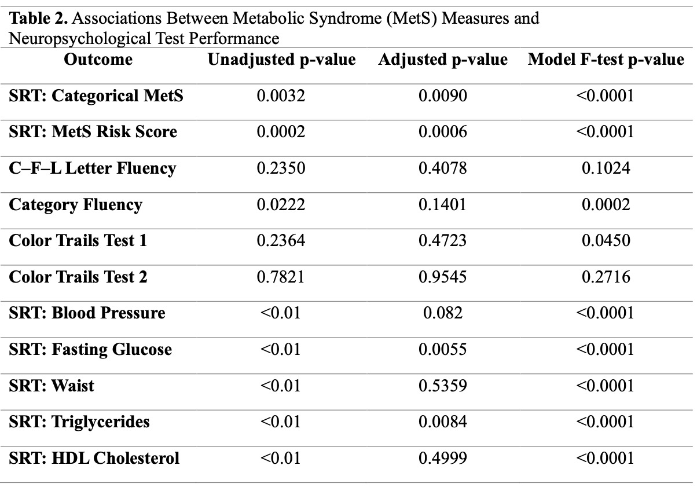
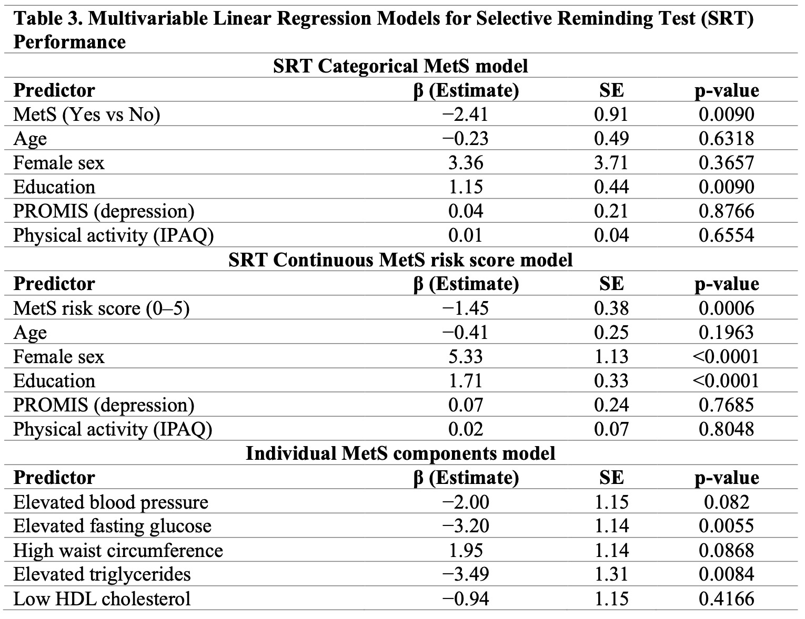
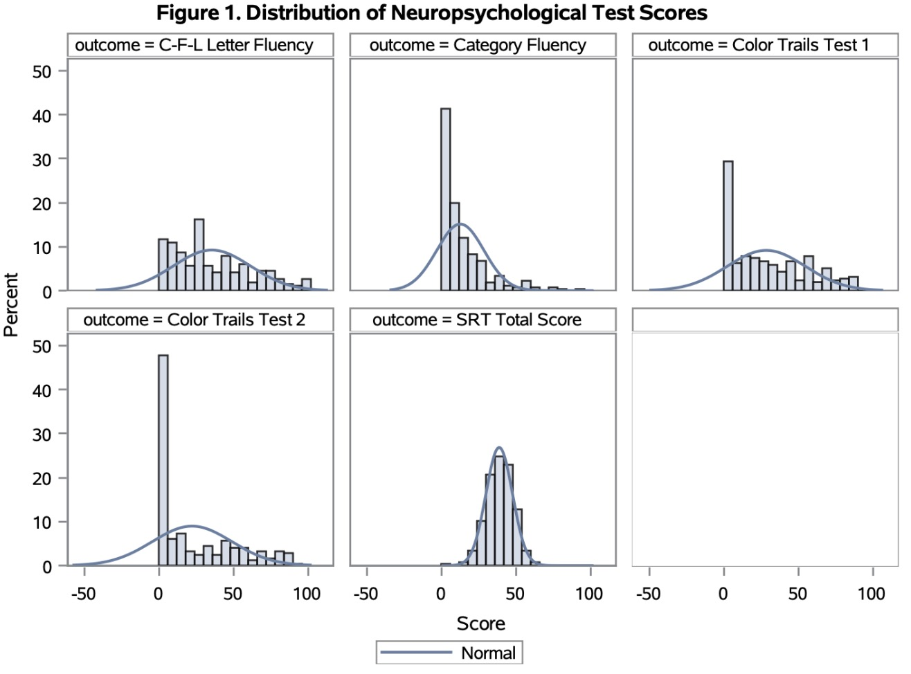
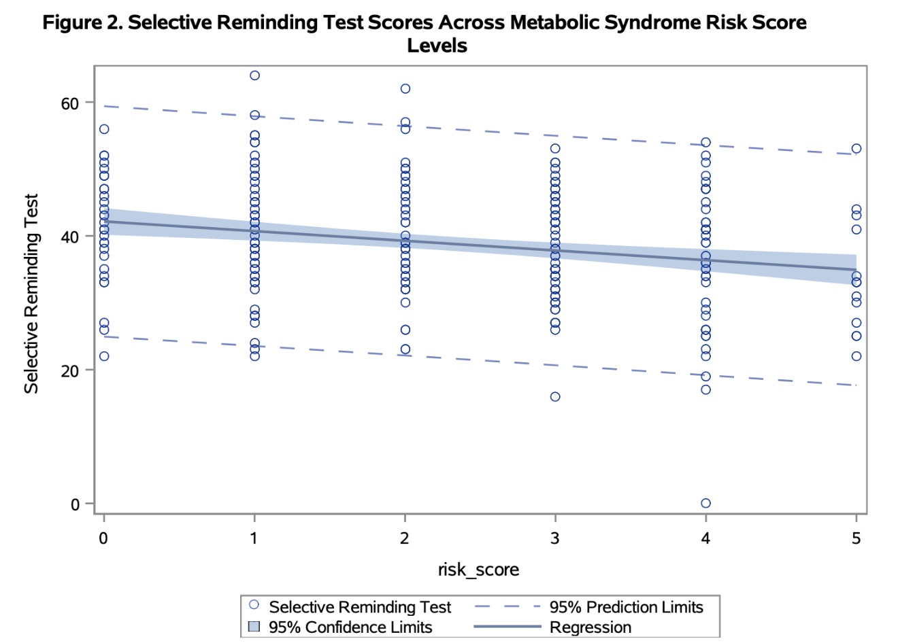

<style>
details {
  margin: 15px 0 25px 0;
}

summary {
  background-color: #2c7fb8;
  color: white;
  padding: 10px 16px;
  border-radius: 8px;
  font-weight: 700;
  cursor: pointer;
  display: inline-block;
}

summary:hover {
  background-color: #1f5f8f;
}

.key-result {
  background-color: #eef6fb;
  border-left: 5px solid #2c7fb8;
  padding: 12px 16px;
  margin: 15px 0;
  border-radius: 6px;
}

.output-box {
  border: 1px solid #ddd;
  border-radius: 10px;
  padding: 18px;
  margin: 18px 0 30px 0;
  background-color: #fafafa;
}

.sas-output-img {
  width: 100%;
  max-width: 950px;
  display: block;
  margin: 18px auto;
  border: 1px solid #ddd;
  border-radius: 8px;
}

.figure-caption {
  text-align: center;
  font-size: 15px;
  color: #666;
  margin-top: -8px;
  margin-bottom: 24px;
}

.section-note {
  color: #666;
  font-size: 15px;
}

.download-box {
  background: #f5f9fc;
  border: 1px solid #dbe7f3;
  padding: 18px 22px;
  border-radius: 10px;
  margin-bottom: 25px;
}

.download-box a {
  display: inline-block;
  margin-right: 15px;
  margin-top: 10px;
  padding: 8px 14px;
  background: #2c7fb8;
  color: white;
  border-radius: 6px;
  text-decoration: none;
  font-weight: 600;
}

.download-box a:hover {
  background: #1f5f8f;
}
</style>

```{r setup, include=FALSE}
library(readxl)
library(dplyr)
library(DT)

raw_data <- read_excel("resource/data/cognition.xlsx", sheet = "Data")

cognition_mets <- raw_data %>%
  select(
    id, sex, age, education, IPAQtotal, promis,
    srt_tot, cfl, cat, ctt1, ctt2,
    meansbp, meandbp, bp_med,
    glucose, diabetes_med, waist, trig, fibrate_med, hdl, lipid_med
  ) %>%
  mutate(
    bp_high = ifelse(meansbp >= 130 | meandbp >= 85 | bp_med == 1, 1, 0),
    glucose_high = ifelse(glucose >= 100 | diabetes_med == 1, 1, 0),
    waist_high = ifelse((sex == 2 & waist >= 89) | (sex == 1 & waist >= 102), 1, 0),
    trig_high = ifelse(trig >= 150 | fibrate_med == 1, 1, 0),
    hdl_low = ifelse((sex == 2 & hdl < 50) | (sex == 1 & hdl < 40) | lipid_med == 1, 1, 0),
    risk_score = bp_high + glucose_high + waist_high + trig_high + hdl_low,
    MetS = ifelse(risk_score >= 3, 1, 0),
    IPAQtotal = ifelse(IPAQtotal %in% c(7777, 8888, 9999), NA, IPAQtotal),
    MetS_label = ifelse(MetS == 1, "MetS", "No MetS"),
    sex_label = ifelse(sex == 2, "Female", "Male")
  )

display_data <- cognition_mets %>%
  rename(
    "Selective Reminding Test" = srt_tot,
    "C-F-L Letter Fluency Test" = cfl,
    "Category Fluency Test" = cat,
    "Color Trails Test 1" = ctt1,
    "Color Trails Test 2" = ctt2,
    "Physical Activity" = IPAQtotal,
    "Depression" = promis,
    "Metabolic Syndrome Status" = MetS,
    "MetS Risk Score" = risk_score
  )
```


<div class="download-box">

This project investigates the relationship between metabolic syndrome (MetS) and cognitive performance in older adults using SAS-based statistical analysis.

<br>

<a href="resource/document/final.sas" target="_blank">Download Full SAS Code</a>

<a href="resource/document/final.docx" target="_blank">Download Full Report</a>

</div>

---

## Overview

- **Outcome:** Selective Reminding Test (SRT) score  
- **Exposure:** Metabolic Syndrome status and continuous MetS risk score  
- **Methods:** Data cleaning, feature engineering, descriptive analysis, hypothesis testing, and multivariable regression  
- **Tools:** SAS, R  

This page highlights selected SAS programming workflow and SAS output. The processed data preview is reproduced in R for interactive web display.

---

## 1. Data Import, Cleaning, and Feature Engineering

<details>
<summary>Click to view SAS code</summary>

```sas
proc import datafile="/home/u64113323/cognition.xlsx"
    out=cognition
    dbms=xlsx
    replace;
    sheet="Data";
    getnames=yes;
run;

data cognition_mets; 
    set cognition
        (keep = id sex age education IPAQtotal promis 
        srt_tot cfl cat ctt1 ctt2 meansbp meandbp bp_med
        glucose diabetes_med waist trig fibrate_med hdl lipid_med
        ); 

    bp_high = (meansbp >= 130 or meandbp >= 85 or bp_med = 1); 
    glucose_high = (glucose >= 100 or diabetes_med = 1); 

    if sex = 2 then waist_high = (waist >= 89); 
    else if sex = 1 then waist_high = (waist >= 102); 

    trig_high = (trig >= 150 or fibrate_med = 1); 

    if sex = 2 then hdl_low = (hdl < 50 or lipid_med = 1); 
    else if sex = 1 then hdl_low = (hdl < 40 or lipid_med = 1); 

    risk_score = sum(bp_high, glucose_high, waist_high, trig_high, hdl_low); 

    if risk_score >= 3 then MetS = 1;
    else MetS = 0;

    if IPAQtotal in (7777, 8888, 9999) then IPAQtotal = .;

    label
        srt_tot = "Selective Reminding Test"
        cfl = "C-F-L Letter Fluency Test"
        cat = "Category Fluency Test"
        ctt1 = "Color Trails Test 1"
        ctt2 = "Color Trails Test 2"
        MetS = "Metabolic Syndrome Status"
        IPAQtotal = "Physical Activity"
        promis = "Depression";
run;
```

</details>

<div class="key-result">
This step imports the cognition dataset, keeps only analysis-relevant variables, constructs individual metabolic syndrome indicators, creates a cumulative MetS risk score, classifies participants by MetS status, handles special missing-value codes, and labels key variables for reporting.
</div>

### Output Data Preview Reproduced in R

```{r output-preview, echo=FALSE, message=FALSE, warning=FALSE}
datatable(
  display_data,
  options = list(
    pageLength = 5,
    dom = 'tp',
    scrollX = TRUE
  ),
  class = "stripe hover compact",
  rownames = FALSE
)
```

---

## 2. Baseline Characteristics by MetS Status

<details>
<summary>Click to view SAS code</summary>

```sas
proc tabulate data=cognition_mets missing;
    class MetS;
    var age promis education IPAQtotal srt_tot cfl cat ctt1 ctt2;
    format MetS yesnofmt.;
    table
        (age promis education IPAQtotal srt_tot cfl cat ctt1 ctt2),
        (all MetS) *
        (n mean std median q1 q3);
run;
```

</details>

<div class="output-box">
This SAS output summarizes participant characteristics overall and by MetS status. It provides the clinical-style Table 1 used to compare baseline characteristics and cognitive outcomes between participants with and without MetS.
</div>



<div class="figure-caption">
Table 1. Baseline characteristics and neuropsychological outcomes by MetS status.
</div>

<div class="key-result">
Participants with MetS had lower SRT total scores compared with participants without MetS, suggesting poorer episodic memory performance.
</div>

---

## 3. Association Between MetS Measures and Cognitive Outcomes

<details>
<summary>Click to view SAS code</summary>

```sas
proc npar1way data=cognition_mets wilcoxon;
    class MetS;
    var srt_tot;
run;

proc glm data=cognition_mets;
    class MetS;
    model srt_tot = MetS age sex education promis IPAQtotal;
run;
quit;

proc glm data=cognition_mets;
    class sex;
    model srt_tot = risk_score age sex education promis IPAQtotal;
run;
quit;
```

</details>

<div class="output-box">
This SAS output summarizes unadjusted and adjusted associations between MetS measures and neuropsychological outcomes.
</div>



<div class="figure-caption">
Table 2. Associations between MetS measures and neuropsychological test performance.
</div>

<div class="key-result">
Both categorical MetS status and continuous MetS risk score were significantly associated with lower SRT performance after adjustment.
</div>

---

## 4. Multivariable Linear Regression Models

<details>
<summary>Click to view SAS code</summary>

```sas
proc glm data=cognition_mets;
    class MetS sex;
    model srt_tot = MetS age sex education promis IPAQtotal / solution;
run;
quit;

proc glm data=cognition_mets;
    class sex;
    model srt_tot = risk_score age sex education promis IPAQtotal / solution;
run;
quit;

proc glm data=cognition_mets;
    class sex;
    model srt_tot = bp_high glucose_high waist_high trig_high hdl_low 
                    age sex education promis IPAQtotal / solution;
run;
quit;
```

</details>

<div class="output-box">
This table presents the adjusted regression models for SRT performance, including categorical MetS, continuous MetS risk score, and individual MetS components.
</div>



<div class="figure-caption">
Table 3. Multivariable linear regression models for SRT performance.
</div>

<div class="key-result">
MetS status, continuous MetS risk score, elevated fasting glucose, and elevated triglycerides were associated with poorer episodic memory performance.
</div>

---

## 5. Distribution of Neuropsychological Test Scores

<details>
<summary>Click to view SAS code</summary>

```sas
data cognition_long;
    set cognition_mets;
    length outcome $30 value 8;

    outcome = "SRT Total Score";        value = srt_tot; output;
    outcome = "C-F-L Letter Fluency";   value = cfl;     output;
    outcome = "Category Fluency";       value = cat;     output;
    outcome = "Color Trails Test 1";    value = ctt1;    output;
    outcome = "Color Trails Test 2";    value = ctt2;    output;

    keep outcome value;
run;

proc sgpanel data=cognition_long;
    panelby outcome / columns=3 rows=2 spacing=10;
    histogram value / transparency=0.2;
    density value / type=normal;
    colaxis label="Score";
    rowaxis label="Percent";
run;
```

</details>



<div class="figure-caption">
Figure 1. Distribution of neuropsychological test scores.
</div>

<div class="key-result">
The outcome distributions were reviewed to guide the choice of statistical tests and modeling approach.
</div>

---

## 6. MetS Risk Score and SRT Performance

<details>
<summary>Click to view SAS code</summary>

```sas
proc sgplot data=cognition_mets;
  scatter x=risk_score y=srt_tot / markerattrs=(symbol=circle) transparency=0.2;
  reg x=risk_score y=srt_tot / cli clm;
  xaxis label="risk_score";
  yaxis label="Selective Reminding Test";
run;
```

</details>



<div class="figure-caption">
Figure 2. Selective Reminding Test scores across MetS risk score levels.
</div>

<div class="key-result">
Higher MetS risk score was associated with lower SRT performance, supporting a dose-response relationship between metabolic burden and episodic memory.
</div>

---

## 7. SAS Skills Demonstrated

- Data import and analysis dataset construction  
- Variable selection using `KEEP`  
- Clinical feature engineering  
- MetS risk score derivation  
- Missing-value handling  
- SAS labels and formats  
- Descriptive statistics using `PROC TABULATE`  
- Nonparametric testing using `PROC NPAR1WAY`  
- Multivariable regression using `PROC GLM`  
- Visualization using `PROC SGPANEL` and `PROC SGPLOT`  

---

## 8. Key Findings

<div class="output-box">

- Metabolic syndrome was associated with poorer episodic memory performance.
- Higher MetS risk score showed a dose-response relationship with lower SRT scores.
- Elevated fasting glucose and triglycerides were the strongest individual metabolic predictors.
- Associations with other neuropsychological outcomes were weaker after adjustment.

</div>

---
